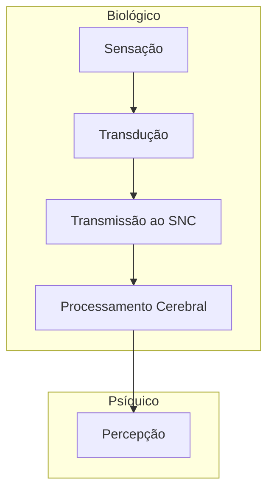

[[Simulada]]
## **O que é Percepção? (Definição Científica)**

A **percepção** é o processo pelo qual o organismo **interpreta estímulos sensoriais** recebidos do ambiente, transformando-os em experiências significativas. Não é simplesmente sentir (sensação), mas **organizar e dar significado** às informações recebidas pelos sentidos. 

---
## **Bases Biológicas da Percepção**
  
A percepção depende diretamente de **processos biológicos que começam nos sistemas sensoriais e terminam no cérebro**:

---
### **Detecção de Estímulos (Sensação)**

- Cada sentido possui **receptores sensoriais especializados** (como fotorreceptores nos olhos ou células ciliadas no ouvido) que detectam estímulos físicos do ambiente — _luz, som, pressão, moléculas químicas_.
    
- **Sensação** é o início do processo: onde os órgãos sensoriais recebem informações do mundo externo. 

---
### **Transdução — Conversão em Sinais Neurais**

- **Transdução** é o processo pelo qual um estímulo físico é convertido em **sinal elétrico no sistema nervoso**.
    
- Esses sinais (impulsos nervosos ou potenciais de ação) são a forma de linguagem que o cérebro usa para processar informações.
    
- Por exemplo:
    
    - A retina converte _luz_ em sinais neurais.
        
    - A cóclea converte _vibrações sonoras_ em impulsos nervosos. 
        
    

Esse passo é **biológico e fundamental**: sem ele, o cérebro não “entenderia” nada do que os sentidos captam. 

---
### **Transmissão ao Sistema Nervoso Central**

- Após a transdução, os sinais viajam através de **vias nervosas especializadas** até o **sistema nervoso central (SNC)**.
    
- Na maioria dos sentidos (exceto o olfato), esses sinais passam pelo **tálamo**, uma importante estação de retransmissão, antes de chegarem ao córtex cerebral. 
    

---
### **Processamento e Interpretação no Cérebro**

- É no **córtex cerebral** (e em outras áreas específicas do cérebro) que os sinais são **organizados e interpretados**.
    
- Por exemplo, a estrutura visual primária no lobo occipital processa características básicas como cor e orientação, enquanto áreas posteriores processam formas e objetos mais complexos. 
    

---
## **Como Biologia e Psicologia se Integram**

- A **psicologia cognitiva e a neurociência** estudam a percepção considerando tanto os aspectos **biológicos (neurofisiológicos)** quanto os aspectos **cognitivos (interpretação e experiência)**. 
    
- Em psicologia, a percepção é vista como um **processo ativo**: o cérebro não apenas recebe sinais, mas os **organiza, integra e interpreta** com base em contextos, expectativas e experiências prévias. 
    

---
## **Resumo Científico em Etapas**

1. **Estímulo ambiental** (luz, som, toque, etc.) alcança os sensores. 
    
2. **Transdução**: os receptores convertem estímulos em sinais elétricos. 
    
3. **Transmissão** desses sinais ao SNC (via nervos sensoriais e tálamo). 
    
4. **Processamento cortical e interpretação**, resultando em **percepção consciente**. 
    

---
## **Referências

- [Sensory Processes – transduction and perception. _Biology LibreTexts_. ](https://bio.libretexts.org/Bookshelves/Introductory_and_General_Biology/General_Biology_%28Boundless%29/36%3A_Sensory_Systems/36.02%3A_Sensory_Processes_-_Transduction_and_Perception)
    
- [Studocu – Processos biológicos básicos: sensação e percepção.](https://www.studocu.com/pt-br/document/faculdade-de-ciencias-medicas-de-minas-gerais/psicologia/processos-biologicos-basicos/83713967) 
    
- [Pressbooks – Sensory Processes & Perception. ](https://pressbooks-dev.oer.hawaii.edu/biology/chapter/sensory-processes/)
    
- [The Psychology of Perception: A Biopsychological Perspective. ](https://www.numberanalytics.com/blog/psychology-of-perception-biopsychological-perspective)
    
- [Estudos de psicobiologia e processos psicológicos básicos (USP). ](https://pos.ffclrp.usp.br/pgusp/pt-br/ffclrp/psicobio/grade/curricular/disciplinas/5945897.1-processos-psicol%C3%B3gicos-b%C3%A1sicos.html)
    

---

