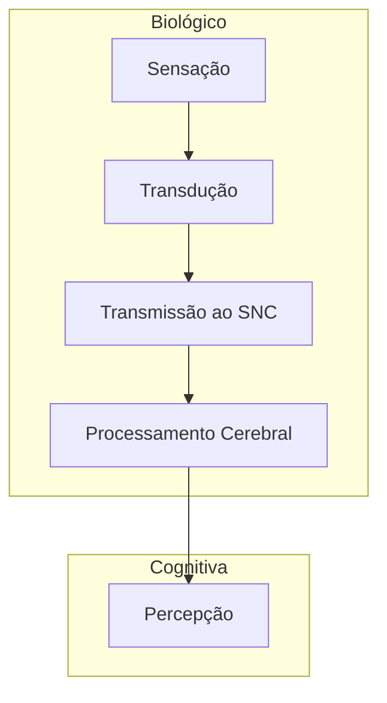

	 É processo mental de cima para baixa (top-down) de organização e interpretação de informações sensoriais. Porém em nossas experiências cotidianas, sensação e percepção são aspectos diferentes de um único processo contínuo.

Nosso processamento top-down constrói percepções a partir do estímulo sensorial valendo-se de nossa experiência e nossas expectativas. (David Myers, 2017, p.210)

Trago como exemplo a distúrbio neurológico Prosopagnosia que afeta a capacidade de perceber rostos. Quando apresentadas a uma pessoa saudável e comparada com uma pessoas saudável, a **sensação** é normal. Seus receptores captam as mesmas informações que seu par comparativo e essas mesmas informações são igualmente enviadas aos sistema nervoso. Porém a **percepção** de que sofrem do distúrbio conseguem reconhecer pessoas pelo jeito de andar, falar, cabelo, mas não pelo rosto.

A percepção então atravessa a parte biológica como os _inputs_ sensoriais até as nossas suposições, expectativas, esquemas e conjuntos perceptivos e o ambiente que nos cerca.

Os processos psicológicos básicos descritos são

Percepção:  
É processo mental de cima para baixa (top-down) de organização e interpretação de informações sensoriais. Porém em nossas experiências cotidianas, sensação e percepção são aspectos diferentes de um único processo contínuo.

Sensação:
É processo mental de cima para baixa (top-down) de organização e interpretação de informações sensoriais. Porém em nossas experiências cotidianas, sensação e percepção são aspectos diferentes de um único processo contínuo.
 
Aprendizagem: 
Mudança relativamente permanente no comportamento produzida pela experiência.

Memória:
Processo pelo qual codificamos, armazenamos e recuperamos informações.

Pensamento e linguagem:
Pensamento e a manipulação das representações mentais da informação e a linguagem é a comunicação da informação por meio de símbolos organizados de acordo com regras sistemáticas.

Motivação:
Fatores que direcionam e energizam
o comportamento dos seres humanos e de outros organismos.

Emoção:
Fatores que direcionam e energizam o comportamento dos seres humanos e de outros organismos.

Referências
___
FELDMAN, Robert S. Introdução à psicologia/ Robert S. 10. ed. Porto Alegre : AMGH, 2015.
MYERS, David G. Psicologia. 13. ed. Rio de Janeiro. LTC,2023
